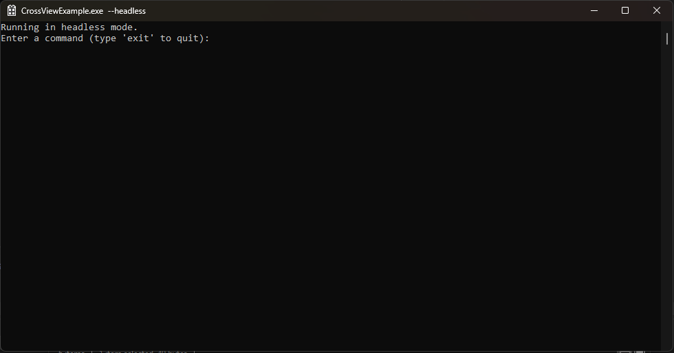

# Almond Engine

Over 4000 hours and nearly 2 years of development has gone into AlmondShell and Almond Engine.


Almond Engine is a contemporary cross-platform C++20 library for creating and managing games. It abstracts platform-specific code behind a unified interface so you can work in a platform-agnostic way while still embracing modern patterns such as DOD, RAII, and concepts.

---

## Features

- **Modern hybrid design** – blends header-only functional programming with targeted object-oriented principles.
- **Cross-platform** – supports Windows, macOS, Linux, Android, iOS, WebAssembly, PS5, Xbox, and a headless console mode (many platforms in progress).
- **Namespace isolation** – encapsulated within the `almond` namespace to avoid global pollution.
- **Custom memory management** – allocators tailored for game workloads, texture pooling, and sprite banks.
- **Modular rendering** – OpenGL, Vulkan, DirectX, and batching-friendly resource management.
- **Split-screen & VR** – native support for local multiplayer and VR integration (planned).
- **GUI framework** – custom UI system with buttons, sliders, and text links integrated with the renderer.
- **Binary save system** – includes time-traversal for seamless gameplay replay.
- **Future-proof focus** – scalable design with multi-threading and async loading in mind.


---

## Tested Platforms

- Windows 10/11
- Linux (Kubuntu / Ubuntu / Debian / KDE)

<p>
  
  
</p>

## Supported Platforms

- **Console** (headless mode)
- **Windows** (Win32)
- **Linux** (XLib working, XCB planned)
- **macOS** (Cocoa, planned)
- **Android** (planned)
- **iOS** (planned)
- **WebAssembly** (Emscripten, planned)
- **PlayStation 5** (planned)
- **Xbox** (planned)

---

## Installation

### Prerequisites

- [vcpkg](https://vcpkg.io/) (Windows and Linux)
- MSVC with C++20 support, Visual Studio 2022, VS Code, or VSCodium
- CMake 3.10 or later

### Clone the Repository

```sh
git clone https://github.com/Autodidac/AlmondEngine.git
cd AlmondEngine
```

### Windows (Win32)

- **Visual Studio 2022** – open `AlmondEngine.sln` located in the repository root.
- **VS Code / VSCodium** – open the top-level folder containing `AlmondEngine.sln`.

### Linux (XLib)

CMake integration is provided through VS Code / VSCodium. Direct CMake usage should also work:

```sh
mkdir build
cd build
cmake ..
cmake --build .
```

---

## Usage

### Console examples

```bat
@echo off
Example_ConsoleApplication.exe
pause
```

```bash
./Example_CMake_Project1
```

### Basic Engine Example *(outdated until finalized)*

```cpp
#include "AlmondEngine.h"

int main() {
    auto engine = almondengine::renderer::createAlmondEngine();
    if (engine->init()) {
        engine->createWindow(L"Example Game", 800, 600);
        // Main loop or additional logic here
        engine->shutdown();
    }
    return 0;
}
```

### API Reference

```cpp
almondengine::AlmondEngine
static std::unique_ptr<AlmondEngine> createAlmondEngine();
bool init();
bool createWindow(const wchar_t* title, int width, int height);
void shutdown();
```

### License
AlmondShell is licensed under the SPDX-License-Identifier: LicenseRef-MIT-NoSell license
See the LICENSE file for details. - **[Download LICENSE](https://github.com/Autodidac/AlmondEngine/raw/main/LICENSE)**
